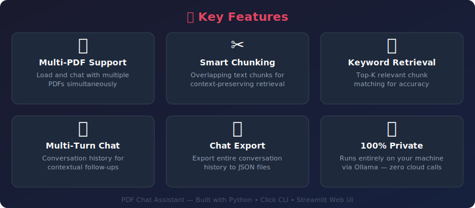
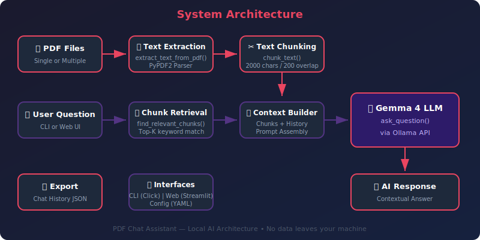

<div align="center">


<h1>📄 PDF Chat Assistant</h1>

<p>


</p>

<p>


</p>

**[Features](#-features) • [Quick Start](#-quick-start) • [CLI](#-cli-reference) • [Web UI](#-web-ui) • [Architecture](#-architecture) • [API](#-api-reference) • [FAQ](#-faq)**

<br/>

> Chat with your PDF documents using a local AI — ask questions, get contextual answers, and keep your data 100% private.

<br/>

🏠 Part of [90 Local LLM Projects](https://github.com/kennedyraju55/90-local-llm-projects)

</div>

---

## 🎯 Why This Project?

Working with PDFs shouldn't mean surrendering your data to the cloud. PDF Chat Assistant lets you
have natural-language conversations with your documents while everything stays on your machine.

| # | Problem | Solution |
|---|---------|----------|
| 1 | **Ctrl+F doesn't understand context** — keyword search fails when your question is conceptual | Semantic chunking + LLM reasoning finds answers even when exact words don't match |
| 2 | **Cloud AI services see your data** — uploading confidential PDFs to ChatGPT or similar services exposes sensitive content | Runs entirely on your local machine via Ollama — zero data leaves your network |
| 3 | **API costs add up fast** — token-based pricing makes heavy PDF analysis expensive | 100 % free after initial setup — no API keys, no subscriptions, no per-token billing |
| 4 | **No internet? No answers** — cloud tools are useless on air-gapped networks or during outages | Fully offline-capable once the model is pulled — works on planes, in secure labs, anywhere |
| 5 | **Lost in long documents** — scrolling through 200-page reports to find one detail wastes hours | Intelligent chunk retrieval surfaces the most relevant passages and synthesizes a direct answer |

---

## ✨ Features



<table>
<tr>
<td width="50%" valign="top">

### 📑 Document Processing
- **Multi-PDF support** — load and query across multiple documents simultaneously with `--pdf`
- **Smart text extraction** — reliable text parsing from any standard PDF via `extract_text_from_pdf`
- **Configurable chunking** — tune `chunk_size` and `overlap` to match your document style

</td>
<td width="50%" valign="top">

### 🧠 Intelligent Q&A
- **Context-aware answers** — `find_relevant_chunks` retrieves the top-k most relevant passages
- **Conversation history** — follow-up questions use prior context for coherent multi-turn dialogue
- **Adjustable creativity** — set `temperature` from 0.0 (deterministic) to 1.0 (creative)

</td>
</tr>
<tr>
<td width="50%" valign="top">

### 🔒 Privacy & Security
- **100 % local** — powered by Ollama; no internet connection required after setup
- **No telemetry** — zero analytics, tracking, or phone-home behavior
- **Your hardware, your rules** — runs on CPU or GPU, on any machine you control

</td>
<td width="50%" valign="top">

### 🛠️ Developer Experience
- **Dual interface** — feature-rich CLI _and_ Streamlit Web UI for every workflow
- **Export chats** — save conversations to timestamped Markdown files with `--export`
- **Extensible config** — YAML-based configuration with CLI overrides via `--config`

</td>
</tr>
</table>

---

## 🚀 Quick Start

### Prerequisites

Before you begin, make sure the following tools are installed and working:

| Requirement | Minimum Version | Check Command |
|-------------|----------------|---------------|
| Python | 3.10+ | `python --version` |
| pip | 23.0+ | `pip --version` |
| Ollama | 0.1.0+ | `ollama --version` |
| Git | 2.30+ | `git --version` |

#### 1. Install Ollama

```bash
# macOS / Linux
curl -fsSL https://ollama.com/install.sh | sh

# Windows — download the installer from https://ollama.com/download
```

#### 2. Pull the default model

```bash
ollama pull gemma4
```

#### 3. Verify the model is available

```bash
ollama list
# You should see "gemma4" in the output
```

> **💡 Tip:** You can use any Ollama-compatible model by changing the `model` field in
> `config.yaml` or passing it through the Web UI settings panel.

---

### Installation

```bash
# Clone the repository
git clone https://github.com/kennedyraju55/90-local-llm-projects.git
cd 90-local-llm-projects/01-pdf-chat-assistant

# Create a virtual environment (recommended)
python -m venv .venv
source .venv/bin/activate   # Linux / macOS
.venv\Scripts\activate      # Windows

# Install dependencies
pip install -r requirements.txt

# Or use the Makefile shortcut
make install
```

<details>
<summary><strong>📦 What gets installed?</strong></summary>

| Package | Purpose |
|---------|---------|
| `PyPDF2` | PDF text extraction |
| `ollama` | Local LLM communication |
| `click` | CLI framework |
| `streamlit` | Web UI |
| `pyyaml` | Configuration parsing |
| `pytest` | Testing framework |
| `rich` | Terminal formatting |

</details>

---

### 🎬 First Run

Drop a PDF into the project and fire up the CLI:

```bash
python -m pdf_chat_assistant --pdf docs/sample.pdf
```

You'll see output like this:

```
╭──────────────────────────────────────────────╮
│  📄 PDF Chat Assistant                       │
│  Model: gemma4 | Chunks: 12 | Temp: 0.7     │
╰──────────────────────────────────────────────╯

Extracting text from: docs/sample.pdf
✔ Extracted 24,831 characters
✔ Created 12 chunks (size=2000, overlap=200)

You: What is the main topic of this document?

🤖 Assistant:
The document primarily discusses sustainable energy
solutions for urban environments, focusing on solar panel
integration in residential buildings...

You: █
```

---

## 💻 CLI Reference

The CLI is the fastest way to interact with your PDFs from the terminal.

### Basic Usage

```bash
# Single PDF
python -m pdf_chat_assistant --pdf report.pdf

# Multiple PDFs
python -m pdf_chat_assistant --pdf report.pdf --pdf appendix.pdf --pdf summary.pdf

# Auto-export the chat session when you quit
python -m pdf_chat_assistant --pdf report.pdf --export

# Use a custom configuration file
python -m pdf_chat_assistant --pdf report.pdf --config my_config.yaml
```

### CLI Options

| Option | Short | Type | Default | Description |
|--------|-------|------|---------|-------------|
| `--pdf` | `-p` | `PATH` | _(required)_ | Path to a PDF file. Can be specified multiple times for multi-document queries. |
| `--export` | `-e` | `FLAG` | `False` | Automatically export the chat transcript to the configured `output_dir` on exit. |
| `--config` | `-c` | `PATH` | `config.yaml` | Path to a custom YAML configuration file. Overrides the default config. |
| `--help` | `-h` | `FLAG` | — | Show the help message and exit. |

### Interactive Commands

Once the chat session is running, these commands are available at the `You:` prompt:

| Command | Action |
|---------|--------|
| `quit` | End the session and exit. If `--export` was passed, the transcript is saved automatically. |
| `export` | Manually export the current conversation to a timestamped Markdown file in the `exports/` directory. |
| `clear` | Clear the conversation history and start fresh with the same loaded PDF(s). |
| _(any text)_ | Ask a question about your loaded document(s). The assistant will retrieve relevant chunks and respond. |

### Example Session

```bash
$ python -m pdf_chat_assistant --pdf financial_report_2024.pdf --export

╭──────────────────────────────────────────────╮
│  📄 PDF Chat Assistant                       │
│  Model: gemma4 | Chunks: 47 | Temp: 0.7     │
╰──────────────────────────────────────────────╯

Extracting text from: financial_report_2024.pdf
✔ Extracted 98,204 characters
✔ Created 47 chunks (size=2000, overlap=200)

You: What was the total revenue for Q3?

🤖 Assistant:
According to the financial report, total revenue for Q3 2024
was $4.2 billion, representing a 12% year-over-year increase
compared to Q3 2023's revenue of $3.75 billion.

You: How does that compare to Q2?

🤖 Assistant:
Q2 2024 revenue was $3.9 billion, so Q3 showed a sequential
increase of approximately 7.7%. The report attributes this
growth primarily to the expansion in the APAC region.

You: export
✔ Chat exported to: exports/chat_2024-01-15_14-32-07.md

You: quit
✔ Session ended. Transcript auto-exported to: exports/chat_2024-01-15_14-32-07.md
```

### Multi-PDF Workflow

```bash
# Load three related documents and query across all of them
python -m pdf_chat_assistant \
  --pdf contracts/vendor_a.pdf \
  --pdf contracts/vendor_b.pdf \
  --pdf contracts/vendor_c.pdf

You: Which vendor offers the longest warranty period?

🤖 Assistant:
Comparing the three contracts:
- Vendor A: 24-month warranty
- Vendor B: 36-month warranty (longest)
- Vendor C: 18-month warranty

Vendor B offers the longest warranty period at 36 months,
which also includes on-site support for the first 12 months.
```

---

## 🌐 Web UI

The Streamlit-based Web UI provides a visual, browser-based experience with the same
capabilities as the CLI.

### Launch

```bash
streamlit run app.py
```

The app opens at `http://localhost:8501` by default.

### Web UI Features

- **📁 File uploader** — drag-and-drop or browse for PDF files in the sidebar
- **⚡ Real-time chunk extraction** — watch as your PDF is parsed and chunked live
- **💬 Chat interface** — type questions and receive streamed answers
- **📜 Chat history** — full scrollable conversation log with user/assistant message bubbles
- **📥 Export button** — download the entire chat as a Markdown file with one click

### Sidebar Settings

The sidebar exposes key configuration options so you can tune behavior without editing YAML:

| Setting | Type | Default | Range / Options |
|---------|------|---------|-----------------|
| **Model** | Dropdown | `gemma4` | Any model available in your local Ollama instance |
| **Temperature** | Slider | `0.7` | `0.0` – `1.0` |
| **Chunk Size** | Number input | `2000` | `500` – `10000` |
| **Top K** | Number input | `3` | `1` – `10` |

### Web UI Walkthrough

1. **Upload** — Click "Browse files" or drag a PDF into the sidebar uploader
2. **Wait for processing** — The status bar shows extraction and chunking progress
3. **Ask** — Type your question into the chat input at the bottom of the page
4. **Review** — The assistant's answer appears with the relevant context highlighted
5. **Export** — Click the "Export Chat" button in the sidebar to download the transcript
6. **Adjust** — Change model, temperature, or chunking settings in the sidebar and ask again

---

## 🏗️ Architecture



### How It Works

The PDF Chat Assistant follows a **Retrieval-Augmented Generation (RAG)** pipeline:

```
┌─────────┐    ┌──────────────┐    ┌────────────┐    ┌──────────┐
│  PDF(s)  │───▶│ Text Extract │───▶│  Chunking  │───▶│  Chunks  │
└─────────┘    └──────────────┘    └────────────┘    └────┬─────┘
                                                          │
┌─────────┐    ┌──────────────┐    ┌────────────┐    ┌────▼─────┐
│  Answer  │◀──│   LLM Call   │◀──│  Context   │◀──│ Retrieve │
└─────────┘    └──────────────┘    └────────────┘    └──────────┘
                                                          ▲
                                                     ┌────┴─────┐
                                                     │ Question │
                                                     └──────────┘
```

#### Step-by-Step

| Step | Function | Description |
|------|----------|-------------|
| 1. **PDF Loading** | `extract_text_from_pdf(pdf_path)` | Reads the PDF file and extracts raw text from every page using PyPDF2. |
| 2. **Multi-PDF Loading** | `extract_text_from_multiple_pdfs(pdf_paths)` | Iterates over a list of PDF paths and concatenates extracted text from all documents. |
| 3. **Text Chunking** | `chunk_text(text, chunk_size=2000, overlap=200)` | Splits the full text into overlapping segments. Overlap ensures context isn't lost at chunk boundaries. |
| 4. **Question Input** | CLI prompt or Web UI input | The user types a natural-language question about the document(s). |
| 5. **Chunk Retrieval** | `find_relevant_chunks(question, chunks, top_k=3)` | Scores each chunk against the question and returns the `top_k` most relevant passages. |
| 6. **LLM Generation** | `ask_question(question, context_chunks, history, model, temperature)` | Sends the question, retrieved context, and conversation history to the local Ollama model. |
| 7. **Answer Display** | CLI / Streamlit | The generated answer is displayed to the user and appended to the conversation history. |

### Project Structure

```
01-pdf-chat-assistant/
├── src/
│   └── pdf_chat_assistant/        # Main Python package
│       ├── __init__.py            # Package initialization
│       ├── core.py                # Core logic: extraction, chunking, retrieval, Q&A
│       ├── cli.py                 # Click-based CLI entry point
│       └── config.py              # YAML config loader and defaults
├── app.py                         # Streamlit Web UI entry point
├── config.yaml                    # Default configuration file
├── tests/
│   ├── __init__.py
│   ├── test_core.py               # Unit tests for core functions
│   ├── test_cli.py                # CLI integration tests
│   └── test_config.py             # Configuration loading tests
├── exports/                       # Auto-generated chat export directory
├── docs/
│   └── images/
│       ├── banner.svg             # README banner graphic
│       ├── features.svg           # Features section graphic
│       └── architecture.svg       # Architecture diagram
├── requirements.txt               # Python dependencies
├── Makefile                       # Build and task automation
├── LICENSE                        # MIT License
└── README.md                      # This file
```

---

## 📚 API Reference

### Core Module — `src/pdf_chat_assistant/core.py`

All core logic is contained in a single module with pure functions for easy testing and reuse.

---

#### `extract_text_from_pdf(pdf_path)`

Extracts all text content from a single PDF file.

| Parameter | Type | Description |
|-----------|------|-------------|
| `pdf_path` | `str` | Absolute or relative path to the PDF file |

**Returns:** `str` — The full extracted text from all pages, concatenated with newlines.

```python
from pdf_chat_assistant.core import extract_text_from_pdf

text = extract_text_from_pdf("reports/annual_2024.pdf")
print(f"Extracted {len(text)} characters from the PDF.")
# Output: Extracted 45,231 characters from the PDF.
```

---

#### `extract_text_from_multiple_pdfs(pdf_paths)`

Extracts and combines text from multiple PDF files into a single string.

| Parameter | Type | Description |
|-----------|------|-------------|
| `pdf_paths` | `list[str]` | List of file paths to PDF documents |

**Returns:** `str` — Combined text from all provided PDFs.

```python
from pdf_chat_assistant.core import extract_text_from_multiple_pdfs

paths = ["doc1.pdf", "doc2.pdf", "doc3.pdf"]
combined_text = extract_text_from_multiple_pdfs(paths)
print(f"Total text length: {len(combined_text)} characters")
# Output: Total text length: 132,847 characters
```

---

#### `chunk_text(text, chunk_size=2000, overlap=200)`

Splits a large text into overlapping chunks for efficient retrieval.

| Parameter | Type | Default | Description |
|-----------|------|---------|-------------|
| `text` | `str` | — | The full text to split into chunks |
| `chunk_size` | `int` | `2000` | Maximum number of characters per chunk |
| `overlap` | `int` | `200` | Number of overlapping characters between consecutive chunks |

**Returns:** `list[str]` — A list of text chunks.

```python
from pdf_chat_assistant.core import chunk_text

text = extract_text_from_pdf("large_document.pdf")
chunks = chunk_text(text, chunk_size=2000, overlap=200)
print(f"Created {len(chunks)} chunks")
# Output: Created 23 chunks

# Custom chunking for shorter documents
small_chunks = chunk_text(text, chunk_size=500, overlap=50)
print(f"Created {len(small_chunks)} smaller chunks")
# Output: Created 91 smaller chunks
```

**How overlap works:**

```
Chunk 1: [========== 2000 chars ==========]
Chunk 2:                      [===== 200 =====][========== 1800 chars ==========]
Chunk 3:                                                        [===== 200 =====][=== ...
```

The overlap ensures that sentences or paragraphs spanning chunk boundaries are captured
in at least one chunk, preventing loss of context.

---

#### `find_relevant_chunks(question, chunks, top_k=3)`

Identifies the most relevant text chunks for a given question.

| Parameter | Type | Default | Description |
|-----------|------|---------|-------------|
| `question` | `str` | — | The user's natural-language question |
| `chunks` | `list[str]` | — | All available text chunks from the document(s) |
| `top_k` | `int` | `3` | Number of top-scoring chunks to return |

**Returns:** `list[str]` — The `top_k` most relevant chunks, ordered by relevance score.

```python
from pdf_chat_assistant.core import find_relevant_chunks

question = "What were the key findings of the study?"
relevant = find_relevant_chunks(question, chunks, top_k=3)

for i, chunk in enumerate(relevant, 1):
    print(f"--- Chunk {i} ({len(chunk)} chars) ---")
    print(chunk[:100] + "...")
```

---

#### `ask_question(question, context_chunks, history, model, temperature)`

Sends a question to the local LLM along with relevant context and conversation history.

| Parameter | Type | Description |
|-----------|------|-------------|
| `question` | `str` | The user's question |
| `context_chunks` | `list[str]` | Relevant text chunks retrieved by `find_relevant_chunks` |
| `history` | `list[dict]` | Conversation history as a list of `{"role": ..., "content": ...}` dicts |
| `model` | `str` | Ollama model name (e.g., `"gemma4"`) |
| `temperature` | `float` | Sampling temperature for response generation |

**Returns:** `str` — The model's generated answer.

```python
from pdf_chat_assistant.core import (
    extract_text_from_pdf,
    chunk_text,
    find_relevant_chunks,
    ask_question,
)

# Full pipeline example
text = extract_text_from_pdf("research_paper.pdf")
chunks = chunk_text(text, chunk_size=2000, overlap=200)

question = "What methodology was used in this research?"
relevant = find_relevant_chunks(question, chunks, top_k=3)

history = []
answer = ask_question(
    question=question,
    context_chunks=relevant,
    history=history,
    model="gemma4",
    temperature=0.7,
)
print(answer)

# Continue the conversation
history.append({"role": "user", "content": question})
history.append({"role": "assistant", "content": answer})

follow_up = "Can you explain that methodology in simpler terms?"
relevant2 = find_relevant_chunks(follow_up, chunks, top_k=3)
answer2 = ask_question(
    question=follow_up,
    context_chunks=relevant2,
    history=history,
    model="gemma4",
    temperature=0.7,
)
print(answer2)
```

---

### Key Classes & Modules

| Module | Location | Responsibility |
|--------|----------|----------------|
| `core` | `src/pdf_chat_assistant/core.py` | PDF extraction, text chunking, chunk retrieval, LLM interaction |
| `cli` | `src/pdf_chat_assistant/cli.py` | Click-based command-line interface, interactive REPL loop |
| `config` | `src/pdf_chat_assistant/config.py` | YAML config loading, default values, environment overrides |
| `app` | `app.py` | Streamlit Web UI layout, session state, sidebar settings |

---

## ⚙️ Configuration

### `config.yaml`

The default configuration file controls all tunable parameters:

```yaml
# ─────────────────────────────────────────────
# PDF Chat Assistant — Configuration
# ─────────────────────────────────────────────

# LLM settings
model: gemma4                  # Ollama model to use for generation
temperature: 0.7               # Sampling temperature (0.0 = deterministic, 1.0 = creative)
max_tokens: 2048               # Maximum tokens in the generated response

# Chunking settings
chunking:
  chunk_size: 2000             # Maximum characters per text chunk
  chunk_overlap: 200           # Overlapping characters between consecutive chunks
  top_k: 3                    # Number of top relevant chunks to retrieve per question

# Export settings
export:
  output_dir: exports          # Directory where chat transcripts are saved
```

### Configuration Precedence

Settings are resolved in the following order (highest priority first):

```
1. CLI flags          (--config, --export)
2. Web UI sidebar     (model, temperature, chunk_size, top_k)
3. Custom config.yaml (via --config path)
4. Default config.yaml
5. Hard-coded defaults in config.py
```

### Environment Variables

You can override specific settings via environment variables:

| Variable | Maps To | Example |
|----------|---------|---------|
| `PDF_CHAT_MODEL` | `model` | `export PDF_CHAT_MODEL=llama3` |
| `PDF_CHAT_TEMPERATURE` | `temperature` | `export PDF_CHAT_TEMPERATURE=0.3` |
| `PDF_CHAT_CHUNK_SIZE` | `chunking.chunk_size` | `export PDF_CHAT_CHUNK_SIZE=1500` |
| `PDF_CHAT_CHUNK_OVERLAP` | `chunking.chunk_overlap` | `export PDF_CHAT_CHUNK_OVERLAP=150` |
| `PDF_CHAT_TOP_K` | `chunking.top_k` | `export PDF_CHAT_TOP_K=5` |
| `PDF_CHAT_MAX_TOKENS` | `max_tokens` | `export PDF_CHAT_MAX_TOKENS=4096` |
| `PDF_CHAT_EXPORT_DIR` | `export.output_dir` | `export PDF_CHAT_EXPORT_DIR=output` |

---

## 🧪 Testing

### Running Tests

```bash
# Run the full test suite
pytest

# Run with verbose output
pytest -v

# Run a specific test file
pytest tests/test_core.py

# Run with coverage report
pytest --cov=src/pdf_chat_assistant --cov-report=term-missing

# Or use the Makefile
make test
```

### Test Categories

| Category | File | What It Tests |
|----------|------|---------------|
| **Core Logic** | `tests/test_core.py` | `extract_text_from_pdf`, `chunk_text`, `find_relevant_chunks`, `ask_question` |
| **CLI** | `tests/test_cli.py` | Command-line argument parsing, `--pdf`, `--export`, `--config` flags, interactive commands |
| **Configuration** | `tests/test_config.py` | YAML loading, default values, environment variable overrides, invalid config handling |

### Test Examples

```python
# tests/test_core.py

def test_chunk_text_creates_correct_number_of_chunks():
    text = "A" * 5000
    chunks = chunk_text(text, chunk_size=2000, overlap=200)
    assert len(chunks) >= 3
    assert all(len(c) <= 2000 for c in chunks)

def test_chunk_text_overlap():
    text = "ABCDEFGHIJ" * 500  # 5000 chars
    chunks = chunk_text(text, chunk_size=2000, overlap=200)
    # Verify overlap: end of chunk N matches start of chunk N+1
    for i in range(len(chunks) - 1):
        overlap_region = chunks[i][-200:]
        assert chunks[i + 1].startswith(overlap_region)

def test_extract_text_from_pdf_returns_string(sample_pdf):
    result = extract_text_from_pdf(sample_pdf)
    assert isinstance(result, str)
    assert len(result) > 0

def test_find_relevant_chunks_returns_top_k():
    chunks = ["chunk about finance", "chunk about weather", "chunk about revenue"]
    result = find_relevant_chunks("What is the revenue?", chunks, top_k=2)
    assert len(result) == 2
```

---

## 🆚 Local LLM vs Cloud AI

Wondering why you should use a local LLM instead of a cloud-based AI service? Here's how
they compare:

| Criteria | 🏠 PDF Chat Assistant (Local) | ☁️ Cloud AI (ChatGPT, Claude, etc.) |
|----------|-------------------------------|--------------------------------------|
| **Privacy** | ✅ 100 % private — data never leaves your machine | ❌ Data uploaded to third-party servers |
| **Cost** | ✅ Free forever after setup | ❌ Per-token or subscription pricing |
| **Internet** | ✅ Fully offline after model download | ❌ Requires constant internet connection |
| **Speed** | ⚡ Depends on local hardware (GPU recommended) | ⚡ Generally fast (cloud infrastructure) |
| **Data control** | ✅ You own and control everything | ❌ Subject to provider's data policies |
| **Model choice** | ✅ Swap any Ollama model freely | ❌ Limited to provider's available models |
| **Customization** | ✅ Full source code access, fork and modify | ❌ Black-box API, limited configuration |
| **Compliance** | ✅ Meets strict data residency requirements | ⚠️ May violate data sovereignty regulations |
| **Setup effort** | ⚠️ Requires Ollama + model download | ✅ Just sign up and start |
| **Model quality** | ⚠️ Smaller models, improving rapidly | ✅ Access to largest frontier models |

> **Bottom line:** If your documents contain sensitive, proprietary, or regulated data,
> local inference is the only responsible choice.

---

## 🔧 Troubleshooting

Common issues and their solutions:

| Issue | Cause | Fix |
|-------|-------|-----|
| `ConnectionError: Failed to connect to Ollama` | Ollama service not running | Run `ollama serve` in a separate terminal |
| `Model 'gemma4' not found` | Model not pulled yet | Run `ollama pull gemma4` |
| `No text extracted from PDF` | PDF contains scanned images, not text | Use an OCR tool to convert the PDF first |
| `Chunks are too large / too small` | Default chunk size doesn't fit your document | Adjust `chunk_size` in `config.yaml` or sidebar |
| `Answers are too vague` | Not enough context retrieved | Increase `top_k` to retrieve more chunks |
| `Answers are too creative` | Temperature too high | Lower `temperature` to `0.3` or `0.2` |
| `Out of memory` | Model too large for available RAM | Switch to a smaller model (e.g., `gemma:2b`) |
| `Export directory not found` | `exports/` folder doesn't exist | Create it manually: `mkdir exports` |

---

## ❓ FAQ

<details>
<summary><strong>📏 Is there a PDF file size limit?</strong></summary>

There is no hard-coded file size limit. The assistant processes PDFs by extracting text page by page,
so even very large documents (500+ pages) work fine. However, keep in mind:

- **Memory:** The full extracted text is held in memory during chunking. A 1,000-page document with
  dense text might use 50–100 MB of RAM for the text alone.
- **Chunk count:** Large documents produce many chunks, which may slow down the retrieval step.
  Consider increasing `chunk_size` for very large files to reduce the total number of chunks.
- **Recommendation:** For documents over 200 pages, consider using `chunk_size=3000` and `top_k=5`
  for better performance.

</details>

<details>
<summary><strong>📚 Can I query multiple PDFs at once?</strong></summary>

Yes! Use the `--pdf` flag multiple times on the CLI:

```bash
python -m pdf_chat_assistant --pdf doc1.pdf --pdf doc2.pdf --pdf doc3.pdf
```

In the Web UI, simply upload multiple files through the file uploader in the sidebar.

The text from all documents is combined and chunked together, so you can ask cross-document
questions like "Compare the findings in document A with document B."

</details>

<details>
<summary><strong>📄 What PDF formats are supported?</strong></summary>

The assistant supports **text-based PDFs** — documents where the text layer is embedded
(e.g., documents created from Word, LaTeX, or other text-based authoring tools).

**Not supported** (without preprocessing):
- Scanned PDFs (image-only) — use OCR tools like Tesseract to convert first
- Password-protected PDFs — remove the password before loading
- PDFs with heavy DRM restrictions

</details>

<details>
<summary><strong>🔧 How do I tune chunk size for better answers?</strong></summary>

Chunk size affects the quality and relevance of answers:

| Chunk Size | Pros | Cons | Best For |
|------------|------|------|----------|
| **500** | Highly focused retrieval | May miss broader context | Short documents, FAQs |
| **1000** | Good balance for most documents | — | General-purpose use |
| **2000** (default) | Captures full paragraphs and sections | May include less relevant text | Reports, papers |
| **4000** | Rich context per chunk | Slower retrieval, more noise | Very long documents |

**Overlap** should typically be 10 % of the chunk size. The default of `200` (10 % of `2000`)
works well in most cases.

Adjust via:
- **CLI:** Edit `config.yaml` → `chunking.chunk_size`
- **Web UI:** Use the "Chunk Size" slider in the sidebar

</details>

<details>
<summary><strong>📥 What format are exported chats?</strong></summary>

Chats are exported as **Markdown files** with the following structure:

```markdown
# PDF Chat Assistant — Export
**Date:** 2024-01-15 14:32:07
**Model:** gemma4
**Documents:** report.pdf, appendix.pdf

---

**You:** What is the main topic of this document?

**Assistant:** The document primarily discusses...

---

**You:** Can you summarize the key findings?

**Assistant:** The key findings include...
```

Files are saved to the `exports/` directory (configurable via `export.output_dir` in
`config.yaml`) with timestamped filenames like `chat_2024-01-15_14-32-07.md`.

</details>

---

## 🤝 Contributing

Contributions are welcome! Whether it's a bug fix, new feature, or documentation improvement,
we'd love your help.

### How to Contribute

1. **Fork** the repository

   ```bash
   # Click "Fork" on GitHub, then clone your fork
   git clone https://github.com/YOUR_USERNAME/90-local-llm-projects.git
   cd 90-local-llm-projects/01-pdf-chat-assistant
   ```

2. **Create a feature branch**

   ```bash
   git checkout -b feature/your-feature-name
   ```

3. **Make your changes**

   ```bash
   # Install dev dependencies
   pip install -r requirements.txt
   
   # Make changes and run tests
   pytest -v
   ```

4. **Commit with a clear message**

   ```bash
   git add .
   git commit -m "feat: add support for DOCX file input"
   ```

5. **Push and open a Pull Request**

   ```bash
   git push origin feature/your-feature-name
   # Then open a PR on GitHub
   ```

### Contribution Guidelines

- Follow existing code style and conventions
- Add tests for new features
- Update documentation for any user-facing changes
- Keep PRs focused — one feature or fix per PR
- Use [conventional commits](https://www.conventionalcommits.org/) for commit messages

---

## 📄 License

This project is licensed under the **MIT License**. See the [LICENSE](LICENSE) file for details.

```
MIT License

Copyright (c) 2024 kennedyraju55

Permission is hereby granted, free of charge, to any person obtaining a copy
of this software and associated documentation files (the "Software"), to deal
in the Software without restriction, including without limitation the rights
to use, copy, modify, merge, publish, distribute, sublicense, and/or sell
copies of the Software, and to permit persons to whom the Software is
furnished to do so, subject to the following conditions:

The above copyright notice and this permission notice shall be included in all
copies or substantial portions of the Software.

THE SOFTWARE IS PROVIDED "AS IS", WITHOUT WARRANTY OF ANY KIND, EXPRESS OR
IMPLIED, INCLUDING BUT NOT LIMITED TO THE WARRANTIES OF MERCHANTABILITY,
FITNESS FOR A PARTICULAR PURPOSE AND NONINFRINGEMENT. IN NO EVENT SHALL THE
AUTHORS OR COPYRIGHT HOLDERS BE LIABLE FOR ANY CLAIM, DAMAGES OR OTHER
LIABILITY, WHETHER IN AN ACTION OF CONTRACT, TORT OR OTHERWISE, ARISING FROM,
OUT OF OR IN CONNECTION WITH THE SOFTWARE OR THE USE OR OTHER DEALINGS IN THE
SOFTWARE.
```

---

<div align="center">

<br/>

Built with ❤️ using local AI

<sub>Part of <a href="https://github.com/kennedyraju55/90-local-llm-projects">90 Local LLM Projects</a> · Project <code>#01</code></sub>

<br/><br/>


</div>
